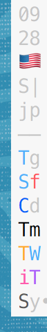
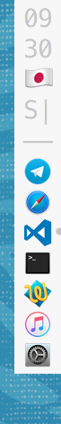

# dotfiles

## resize_terminal.sh
- Resizes terminal windows and positions them automatically on creation

## minidock.sh
&nbsp;&nbsp;&nbsp; 
&nbsp;&nbsp;&nbsp; 
&nbsp;&nbsp;&nbsp; 

- `.bash_profile` launches
  [minidock.sh](https://github.com/junosan/minidock.sh) on iTerm2 

## .vimrc & Code.terminal (for macOS Terminal.app)

