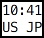
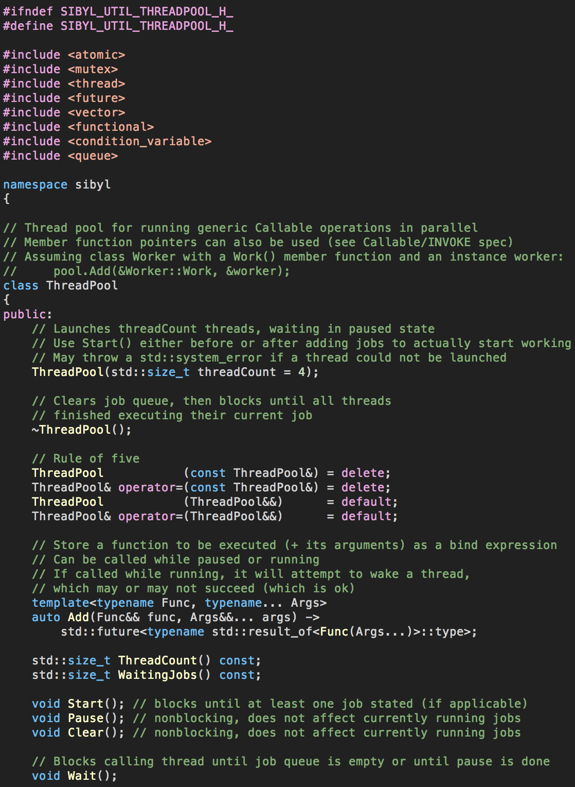

# dotfiles

## init_scripts/resize_terminal.sh
- Resizes terminal windows and positions them automatically on creation

## init_scripts/watch_status.sh

- Creates a tiny status display with
  - Clock
  - Input method's language (second line, left)
  - Internet connection status (second line, right)
    - NC: no connection
    - ISO alpha-2 country code: to see if VPN is enabled
- Intended to be used with the macOS menu bar automatically hidden
- Placed at top right corner; automatically adjusts to screen size changes 
- Uses iTerm2's title-bar-less window

## .vimrc & Code.terminal (for macOS Terminal.app)

